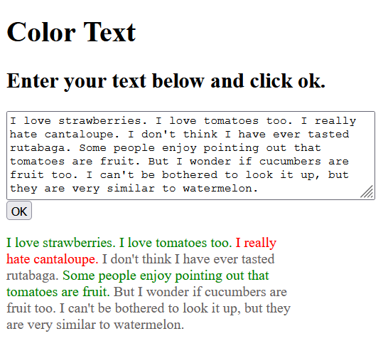

# colorText

Enter a text, and click ok. Then you will see your text with emotional color coding. 

The UI is still a work in progress. 

The sentimental analysis is performed by SENTIM-API, which you may find at the link below: 

<a href="https://sentim-api.herokuapp.com/" target="_blank">SENTIM-API<a> 

For any inquiries, please contact me via the email link below: 

<a href="mailto:pilibili@protonmail.com">Send mail</a>

